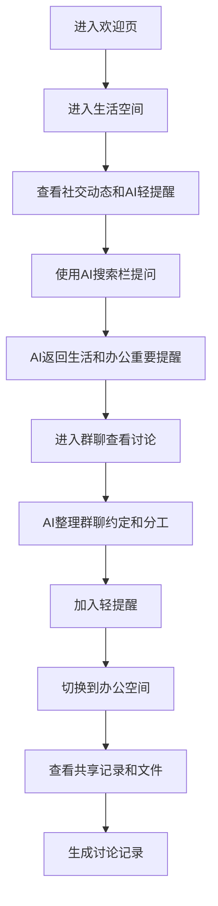

# 灵枢 - 产品需求文档 (PRD)

## 1. 产品概述

灵枢 是一款支持生活/办公双空间的 AI 原生轻社交软件。它以聊天和关系为核心，用 AI 搜索栏统一完成搜索、提问、整理和提醒，让用户在自然交流中轻松处理生活约定与轻办公事务。目标用户为普通年轻用户、学生群体、朋友小圈子、兴趣社群、自由职业者及小团队。

## 2. 核心功能

### 2.1 功能模块

1. **欢迎页**：产品介绍、标语、入口按钮、轻社交卡片展示
2. **生活空间首页**：社交动态流、AI 轻提醒、跨空间重要提醒
3. **办公空间首页**：轻协作内容、共享记录、待确认分工、重要文件
4. **AI 搜索弹窗**：自然语言搜索、提问、整理、范围筛选、结构化结果
5. **私聊界面**：自然聊天、AI 小助手（回复建议、总结、偏好记忆）
6. **群聊界面**：聊天内容、AI 整理面板（分工、时间、待确认）
7. **关系记忆页面**：好友/群组记忆卡、兴趣偏好、沟通偏好、互动建议
8. **轻提醒页面**：今天/本周/待确认/已完成分区、空间筛选
9. **共享记录页面**：讨论记录生成、AI 推荐整理、记录详情
10. **文件页面**：最近文件、群文件、收藏文件、AI 文件操作

### 2.2 页面详情

| 页面名称 | 模块名称 | 功能描述 |
|---------|---------|---------|
| 欢迎页 | Hero 区域 | 产品名称"灵枢"，标语"让每一次聊天，都更有回应"，副标题，两个入口按钮 |
| 欢迎页 | 轻社交卡片 | 展示 AI 记忆、轻提醒、群聊摘要、跨空间提醒四张卡片 |
| 生活空间首页 | 空间切换 | 生活/办公胶囊式切换按钮，蓝紫渐变高亮选中项 |
| 生活空间首页 | AI 搜索栏 | 搜索栏占位文字"问 AI 或搜索聊天、好友、群组、记录..."，点击弹出搜索弹窗 |
| 生活空间首页 | 社交动态流 | 朋友动态、群聊更新、活动讨论等社交内容 |
| 生活空间首页 | AI 轻提醒 | 右侧面板显示生活提醒和跨空间重要提醒 |
| 办公空间首页 | 轻协作内容 | 最近讨论、共享记录、待确认分工、重要文件 |
| 办公空间首页 | AI 轻提醒 | 右侧面板显示办公提醒和跨空间生活提醒 |
| AI 搜索弹窗 | 搜索输入 | 自然语言输入，示例问题引导 |
| AI 搜索弹窗 | 范围筛选 | 当前空间、生活空间、办公空间、全部空间、重要提醒 |
| AI 搜索弹窗 | 结果展示 | AI 回答、相关聊天、相关记录、快捷操作按钮 |
| 私聊界面 | 聊天区域 | 聊天气泡、消息展示 |
| 私聊界面 | AI 小助手 | 帮你回复、总结聊天、记住偏好、生成约定提醒、正式表达、生成确认消息 |
| 群聊界面 | 聊天区域 | 多人聊天气泡 |
| 群聊界面 | AI 整理面板 | 聊天重点、成员分工、时间安排、待确认事项 |
| 关系记忆 | 好友列表 | 好友头像和名称列表 |
| 关系记忆 | 好友记忆卡 | 兴趣偏好、最近聊到、沟通偏好、协作记忆、互动建议 |
| 关系记忆 | 群组记忆卡 | 最近主题、常见成员、待确认事项、AI 建议 |
| 轻提醒 | 筛选栏 | 全部/生活/办公/重要筛选 |
| 轻提醒 | 提醒列表 | 今天/本周/待确认/已完成分区展示 |
| 轻提醒 | AI 建议 | 提醒话术生成、讨论记录生成 |
| 共享记录 | 记录列表 | 最近生成、AI 推荐整理 |
| 共享记录 | 记录详情 | 聊天重点、已确认、待确认、相关聊天来源 |
| 文件页面 | 文件列表 | 最近文件、群文件、收藏文件、AI 已整理文件 |
| 文件页面 | AI 文件操作 | 总结文件、提取待确认事项、生成回复、整理成共享记录 |

## 3. 核心流程

## 4. 用户界面设计

### 4.1 设计风格

- **主色**：#4F7CFF（蓝），辅助色：#8B5CF6（紫）
- **背景色**：#F7F8FA，卡片色：#FFFFFF
- **主文字**：#111827，辅助文字：#6B7280
- **边框色**：#E5E7EB
- **重要提醒**：#F59E0B（橙），完成：#22C55E（绿）
- **按钮风格**：圆角胶囊式，蓝紫渐变高亮
- **字体**：使用 Noto Sans SC（中文）搭配 DM Sans（英文/数字），保持现代感和可读性
- **布局**：卡片式布局，大量留白，圆角卡片，轻微阴影，蓝紫渐变点缀
- **图标**：使用 lucide-react 图标库，柔和线性风格
- **整体感觉**：轻社交、AI 陪伴、高级感、年轻化、低压力、温和、干净

### 4.2 页面设计概述

| 页面名称 | 模块名称 | UI 元素 |
|---------|---------|--------|
| 欢迎页 | Hero 区域 | 居中布局，大标题，蓝紫渐变文字，副标题，两个胶囊按钮 |
| 欢迎页 | 轻社交卡片 | 右侧 2x2 网格卡片，圆角，轻微阴影，各含图标和摘要 |
| 生活空间首页 | 空间切换 | 左上角胶囊按钮组，蓝紫渐变高亮 |
| 生活空间首页 | AI 搜索栏 | 顶部居中，大圆角输入框，柔和阴影，搜索图标 |
| 生活空间首页 | 社交动态流 | 左侧主区域，卡片列表，头像+内容+时间 |
| 生活空间首页 | AI 轻提醒 | 右侧面板，小卡片，橙色标记重要提醒 |
| 办公空间首页 | 轻协作内容 | 左侧主区域，卡片分组 |
| 办公空间首页 | AI 轻提醒 | 右侧面板，与生活空间一致布局 |
| AI 搜索弹窗 | 搜索输入 | 顶部大输入框，下方示例问题标签 |
| AI 搜索弹窗 | 结果展示 | 结构化结果卡片，分类标题，快捷操作按钮 |
| 私聊界面 | 聊天区域 | 气泡式对话，对方左对齐灰色，自己右对齐蓝色 |
| 私聊界面 | AI 小助手 | 右侧面板，功能列表，AI 建议卡片 |
| 群聊界面 | 聊天区域 | 多用户气泡，不同颜色头像区分 |
| 群聊界面 | AI 整理面板 | 右侧面板，结构化整理内容，操作按钮 |
| 关系记忆 | 好友记忆卡 | 中间卡片，分区展示偏好、记忆、建议 |
| 轻提醒 | 提醒列表 | 分区卡片，时间轴样式，筛选标签 |
| 共享记录 | 记录详情 | 卡片展开，分区展示要点 |
| 文件页面 | 文件列表 | 文件图标+名称+日期，简洁列表 |

### 4.3 响应式设计

桌面优先设计，最大宽度 1440px 居中。移动端适配通过 Tailwind 响应式断点实现，侧边栏在移动端折叠为抽屉式。

## 5. 数据说明

所有 AI 功能使用本地模拟数据，不需要真实接入大模型 API。页面切换和交互通过 React 状态管理实现。