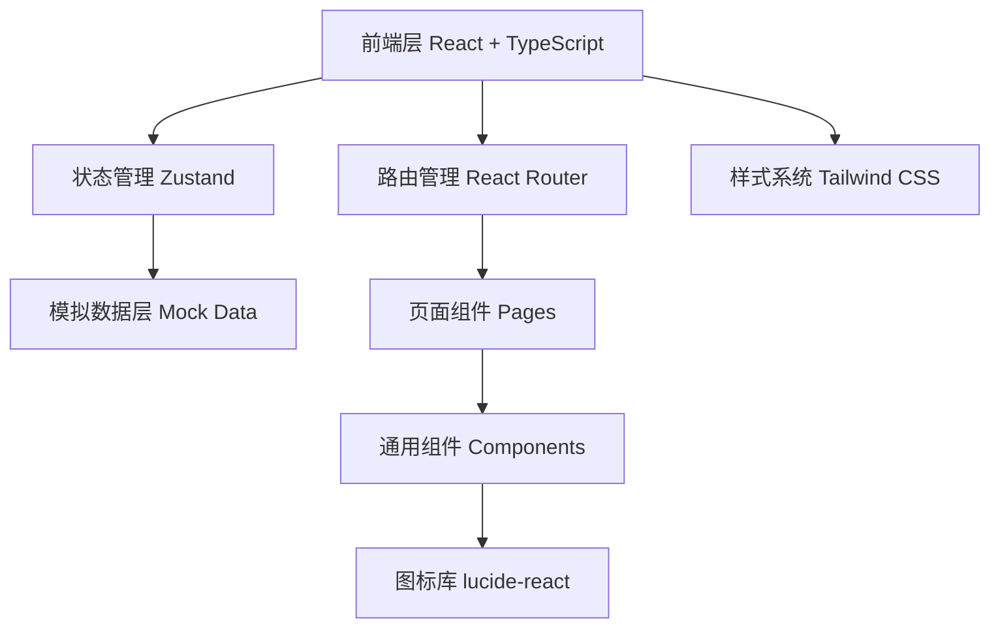

# 灵枢 - 技术架构文档

## 1. 架构设计



项目采用纯前端 SPA 架构，无需后端服务。所有数据使用本地模拟数据，AI 功能通过预定义的 mock 响应实现。

## 2. 技术说明

- **前端框架**：React@18 + TypeScript
- **样式方案**：Tailwind CSS@3
- **构建工具**：Vite
- **初始化工具**：vite-init（react-ts 模板）
- **状态管理**：Zustand
- **路由**：React Router DOM
- **图标**：lucide-react
- **后端**：无（纯前端 Demo）
- **数据库**：无（使用本地 mock 数据）

## 3. 路由定义

| 路由 | 页面 | 说明 |
|------|-----|------|
| `/` | WelcomePage | 欢迎页，产品介绍和入口 |
| `/home` | HomePage | 生活空间首页（默认空间） |
| `/chat/:id` | ChatPage | 私聊/群聊界面 |
| `/relations` | RelationsPage | 关系记忆页面 |
| `/reminders` | RemindersPage | 轻提醒页面 |
| `/records` | RecordsPage | 共享记录页面 |
| `/records/:id` | RecordDetailPage | 共享记录详情 |
| `/files` | FilesPage | 文件页面 |

## 4. 组件树结构

```
App
├── WelcomePage
│   ├── HeroSection
│   └── FeatureCards
├── MainLayout (共享布局)
│   ├── Sidebar (左侧导航)
│   │   ├── SpaceSwitcher (生活/办公切换)
│   │   ├── NavItems (导航项)
│   │   └── UserAvatar
│   ├── TopBar
│   │   └── AISearchBar (AI 搜索栏)
│   ├── MainContent (中间内容区)
│   │   ├── HomePage (生活空间首页)
│   │   │   ├── SocialFeed (社交动态流)
│   │   │   └── AIReminders (AI 轻提醒面板)
│   │   ├── OfficeHomePage (办公空间首页)
│   │   │   ├── RecentDiscussions
│   │   │   ├── SharedRecords
│   │   │   ├── PendingTasks
│   │   │   └── ImportantFiles
│   │   ├── ChatPage (聊天页面)
│   │   │   ├── ChatMessages (聊天消息列表)
│   │   │   ├── ChatInput (输入框)
│   │   │   └── AIAssistant (AI 小助手/整理面板)
│   │   ├── RelationsPage (关系记忆)
│   │   │   ├── ContactList
│   │   │   ├── FriendMemoryCard
│   │   │   └── GroupMemoryCard
│   │   ├── RemindersPage (轻提醒)
│   │   │   ├── ReminderFilter
│   │   │   └── ReminderList
│   │   ├── RecordsPage (共享记录)
│   │   │   ├── RecordList
│   │   │   └── RecordDetail
│   │   └── FilesPage (文件)
│   │       └── FileList
│   └── RightPanel (右侧面板 - 提醒/建议)
│       └── CrossSpaceReminders
├── AISearchModal (AI 搜索弹窗)
│   ├── SearchInput
│   ├── SearchScopeFilter
│   └── SearchResults
└── Toast (通知提示)
```

## 5. 状态管理设计 (Zustand)

```typescript
// 空间状态
interface SpaceState {
  currentSpace: 'life' | 'office';
  switchSpace: (space: 'life' | 'office') => void;
}

// AI 搜索状态
interface SearchState {
  isOpen: boolean;
  query: string;
  scope: 'current' | 'life' | 'office' | 'all' | 'important';
  results: SearchResult[] | null;
  openSearch: () => void;
  closeSearch: () => void;
  setQuery: (q: string) => void;
  setScope: (s: string) => void;
  search: () => void;
}

// 提醒状态
interface ReminderState {
  reminders: Reminder[];
  addReminder: (r: Reminder) => void;
  markComplete: (id: string) => void;
}

// 聊天状态
interface ChatState {
  activeChat: Chat | null;
  messages: Message[];
  setActiveChat: (chat: Chat) => void;
  sendMessage: (text: string) => void;
}
```

## 6. 数据模型

### 6.1 核心数据类型

```typescript
interface Reminder {
  id: string;
  title: string;
  time: string;
  space: 'life' | 'office';
  importance: 'normal' | 'important' | 'private';
  status: 'today' | 'week' | 'pending' | 'done';
  source?: string;
}

interface ChatMessage {
  id: string;
  senderId: string;
  senderName: string;
  content: string;
  timestamp: string;
  isAI?: boolean;
}

interface FriendMemory {
  id: string;
  name: string;
  avatar: string;
  interests: string[];
  recentTopics: string[];
  communicationStyle: string;
  collaborationMemory: string[];
  suggestions: string[];
}

interface SharedRecord {
  id: string;
  title: string;
  summary: string;
  confirmed: string[];
  pending: string[];
  sourceChat: string;
  date: string;
}

interface FileItem {
  id: string;
  name: string;
  type: string;
  size: string;
  date: string;
  category: 'recent' | 'group' | 'starred' | 'ai-organized';
}
```

### 6.2 模拟数据

所有数据预定义在 `src/data/` 目录下的 TypeScript 文件中，包括：
- `mockReminders.ts`：轻提醒数据
- `mockChats.ts`：聊天和消息数据
- `mockRelations.ts`：关系记忆数据
- `mockRecords.ts`：共享记录数据
- `mockFiles.ts`：文件数据
- `mockSearchResults.ts`：AI 搜索结果
- `mockSocialFeed.ts`：社交动态数据